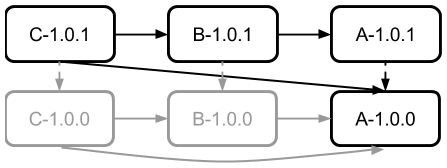

# Stage 1

## Maven

Build succeeds, output is:
<pre>C-1.0.1 -> A-1.0.0
C-1.0.1 -> B-1.0.1 -> A-1.0.0</pre>

## Gradle

Build succeeds, output is:
<pre>C-1.0.1 -> A-1.0.1
C-1.0.1 -> B-1.0.1 -> A-1.0.1</pre>

