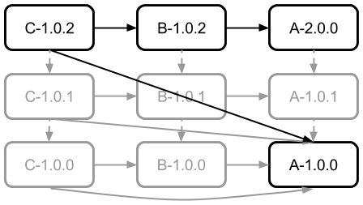

This stage contains all three modules at version 1.0.1 with the Maven build
system. This depends on the outputs of Stage 1 (<code>maven/stage1$ <strong>mvn
install</strong></code>).

To build and run, start in `stage2/` and follow these steps:

<pre>maven/stage2$ <strong>mvn install</strong>
...
maven/stage2$ <strong>cd C</strong></pre>
At this stage, the dependency tree looks like this:

<pre>maven/stage2/C$ <strong>mvn dependency:tree -Dverbose</strong>
...
com.implementsblog.runtimeerrors:C:jar:1.0.1
+- com.implementsblog.runtimeerrors:A:jar:1.0.0:compile
\- com.implementsblog.runtimeerrors:B:jar:1.0.1:compile
   \- (com.implementsblog.runtimeerrors:A:jar:1.0.1:compile - omitted for conflict with 1.0.0)</pre>

Next, to run the example,

<pre>maven/stage2/C$ <strong>mvn package appassembler:assemble</strong>
...
maven/stage2/C$ <strong>./target/appassembler/bin/C</strong></pre>

Which should output the following:

<pre>C-1.0.1 -> A-1.0.0
C-1.0.1 -> B-1.0.1 -> A-1.0.0</pre>

Though `B-1.0.1` depends on `A-1.0.1`, it calls `A-1.0.0` because `C-1.0.1`
depends on `A-1.0.0`. This is an example of Maven's ["nearest
definition"](http://maven.apache.org/guides/introduction/introduction-to-dependency-mechanism.html)
strategy for managing transient dependencies.