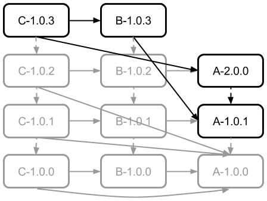

# Stage 3

## Maven & Gradle 

Build succeeds, but fails with a runtime error:
<pre>
Exception in thread "main" java.lang.NoSuchMethodError:
    com.implementsblog.a.A.call()Ljava/lang/String;
        at com.implementsblog.b.B.call(B.java:7)
        at com.implementsblog.c.C.call(C.java:9)
        at com.implementsblog.c.C.main(C.java:13)
</pre>
